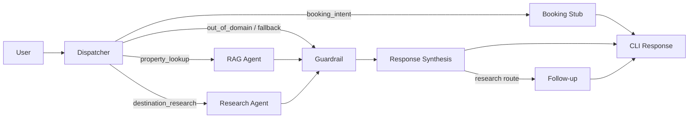

# TNL-HELP — AI Concierge MVP

A LangGraph-based multi-agent AI Concierge built on spec-first engineering principles, using the Club Wyndham travel/hospitality domain as the business case. The repo is the deliverable: a structured argument in running code demonstrating production-pattern AI orchestration.



---

## Table of Contents

- [Overview](#overview)
- [Tech Stack](#tech-stack)
- [Project Structure](#project-structure)
- [Quick Start](#quick-start)
- [Configuration](#configuration)
- [How It Works](#how-it-works)
  - [Hybrid Dispatcher Routing](#hybrid-dispatcher-routing)
  - [Agent Descriptions](#agent-descriptions)
  - [Memory Architecture](#memory-architecture)
  - [Observability & Tracing](#observability--tracing)
- [Testing](#testing)
- [Architecture Decision Records](#architecture-decision-records)
- [Navigating This Repo](#navigating-this-repo)
- [JD Mapping Table](#jd-mapping-table)

---

## Overview

TNL-HELP is a 5-day MVP demonstrating:

- **Spec-driven multi-agent engineering** — `spec/concierge-spec.md` committed before any runtime code
- **Hybrid dispatcher routing** — deterministic Stage 1 rules + LLM Stage 2 escalation with confidence scores
- **Per-agent model policy** — each agent declares its own Claude model via `prompts/{agent}/policy.yaml`
- **File-based dual-store memory** — user profiles (persistent) + session state (write-once), inspectable JSON, zero infrastructure
- **Production-pattern guardrails** — confidence thresholding, out-of-domain deflection, clarification loops, human handoff
- **Full observability** — structured `[trace]` output at every node boundary with field allowlist/denylist

---

## Tech Stack

| Layer | Technology |
|---|---|
| Language | Python 3.11+ |
| Graph orchestration | LangGraph 1.0.9 (StateGraph) |
| LLM provider | Anthropic Claude (Opus 4.6 / Sonnet 4.6 / Haiku 4.5) |
| Data validation | Pydantic 2.x |
| Web search | DuckDuckGo Search 8.x (no API key required) |
| Configuration | YAML policy files per agent |
| Memory | Local JSON files (profiles + sessions) |
| Testing | pytest 9.x + pytest-asyncio |
| Linting | Ruff + mypy (strict) |
| Dependency management | uv (pinned via `uv.lock`) |

**Model assignment per agent:**

| Agent | Normal mode | Fast mode (`--fast-mode`) |
|---|---|---|
| Dispatcher | claude-opus-4-6 | claude-haiku-4-5 |
| Research Agent | claude-sonnet-4-6 | claude-haiku-4-5 |
| Response Synthesis | claude-sonnet-4-6 | claude-haiku-4-5 |
| RAG Agent | claude-haiku-4-5 | claude-haiku-4-5 |
| Guardrail | claude-haiku-4-5 | claude-haiku-4-5 |
| Follow-up | claude-haiku-4-5 | claude-haiku-4-5 |

---

## Project Structure

```
TNL-HELP/
├── main.py                         # CLI entry point (--user, --fast-mode)
├── validate_config.py              # 11-check pre-flight validation
├── langgraph.json                  # LangGraph graph export
├── pyproject.toml                  # Python project config (Python 3.11+)
├── requirements.txt                # Pinned dependencies (uv-managed)
├── .env.example                    # Required env var template
│
├── spec/
│   └── concierge-spec.md           # Authoritative contract: state, types, edge topology
│
├── config/
│   └── routing_rules.yaml          # Stage 1 routing patterns + escalation_threshold: 0.72
│
├── prompts/
│   ├── dispatcher/                 # policy.yaml + v1.yaml + v2.yaml
│   ├── rag_agent/                  # policy.yaml + v1.yaml
│   ├── research_agent/             # policy.yaml + v1.yaml
│   ├── response_synthesis/         # policy.yaml + v1.yaml
│   ├── guardrail/                  # policy.yaml + v1.yaml
│   └── followup/                   # policy.yaml + v1.yaml
│
├── src/concierge/
│   ├── state.py                    # ConciergeState TypedDict + NodeName constants
│   ├── trace.py                    # Centralized trace() with field allowlist/denylist
│   ├── graph/__init__.py           # StateGraph topology, conditional edges, compilation
│   ├── agents/
│   │   ├── dispatcher.py           # Hybrid Stage 1 + Stage 2 routing
│   │   ├── rag_agent.py            # KB retrieval (+ optional LLM ranking)
│   │   ├── research_agent.py       # DuckDuckGo web search (+ optional LLM ranking)
│   │   ├── response_synthesis.py   # Blended output with inline source attribution
│   │   ├── guardrail.py            # Confidence gate, out-of-domain, clarification, handoff
│   │   ├── followup.py             # Proactive suggestions (research route only)
│   │   ├── booking_agent.py        # Integration stub (BedrockBookingAPI swap point)
│   │   ├── mock_knowledge_base.py  # JSON KB with production swap-point comments
│   │   └── token_budget_manager.py # Context compression stub (activates at 6000 tokens)
│   └── nodes/                      # Thin node delegates wiring agents into the graph
│
├── agents/
│   └── kb/knowledge_base.json      # 6 travel destinations (Bali, Phuket, Koh Samui, Tokyo, Bangkok, Maldives)
│
├── memory/
│   ├── README.md                   # Memory architecture documentation
│   ├── profiles/alex.json          # Demo user profile (past trips, preferences, cached research)
│   └── sessions/                   # Write-once session state (git-excluded)
│
├── docs/
│   ├── adr/
│   │   ├── 001-context-window-ownership.md
│   │   ├── 002-multi-model-strategy.md
│   │   ├── 003-anthropic-only-mvp.md
│   │   ├── 004-file-based-memory.md
│   │   └── 005-langgraph-framework-selection.md
│   └── CLAUDE_langgraph.md         # LangGraph spec compliance guide
│
├── tests/
│   ├── unit/                       # 46 story-driven unit tests
│   ├── e2e/                        # 8 end-to-end scenario tests
│   └── integration/                # Integration fixtures (mocks Anthropic client)
│
└── demo_script.md                  # 5 pre-validated queries with expected routing paths
```

---

## Quick Start

### Prerequisites

- Python 3.11+
- An [Anthropic API key](https://console.anthropic.com/)

### Install

```bash
# Clone and enter the repo
git clone <repo-url>
cd TNL-HELP

# Create virtual environment and install dependencies (using uv)
pip install uv
uv sync

# Copy and fill environment variables
cp .env.example .env
# Set ANTHROPIC_API_KEY=sk-ant-...
```

### Validate configuration

```bash
python validate_config.py
```

Runs 11 ordered pre-flight checks: Python version, API key presence, policy YAML schemas, model allowlist, prompt version files, dispatcher token limit (exact 128), guardrail threshold ordering, routing config, LangGraph version, memory profile integrity, and optional API probe.

### Run the concierge

```bash
# Standard mode (Opus/Sonnet/Haiku per policy)
python main.py --user alex

# Fast mode — all agents use Haiku (for development / cost savings)
python main.py --user alex --fast-mode
```

### Reset demo profile

```bash
git checkout -- memory/profiles/alex.json
```

### Run demo script

See [`demo_script.md`](demo_script.md) for 5 pre-validated queries with expected routing paths and confidence scores.

---

## Configuration

### Environment variables (`.env`)

| Variable | Required | Description |
|---|---|---|
| `ANTHROPIC_API_KEY` | Yes | Anthropic API key |
| `LANGCHAIN_TRACING_V2` | No | Enable LangSmith tracing |
| `LANGCHAIN_API_KEY` | No | LangSmith API key |
| `LANGCHAIN_PROJECT` | No | LangSmith project name (default: `tnl-help`) |
| `SKIP_API_PROBE` | No | Set to `1` to skip API connectivity check |

### Agent policy (`prompts/{agent}/policy.yaml`)

Each agent declares its own policy contract:

```yaml
agent_name: research_agent
configured_model: claude-sonnet-4-6
prompt_version: v1
max_tokens: 1024
confidence_threshold: 0.70
allowed_tools:
  - duckduckgo_search
```

`--fast-mode` overrides `configured_model` to `claude-haiku-4-5` at runtime via the `AgentPolicy.model` property — no code changes required.

### Routing rules (`config/routing_rules.yaml`)

```yaml
escalation_threshold: 0.72   # Stage 1 confidence required to skip LLM call

rules:
  - pattern: <regex>
    intent: property_lookup
    route: rag
    score: 0.91
  - pattern: <regex>
    intent: booking_intent
    route: booking_stub
    score: 0.95
  ...
```

---

## How It Works

### Hybrid Dispatcher Routing

Every user turn passes through the Dispatcher, which runs a two-stage routing pipeline:

**Stage 1 — Rule-based pre-filter:**
Loads `config/routing_rules.yaml` and applies keyword/regex patterns to the user input. If a match exceeds `escalation_threshold: 0.72`, the intent is resolved deterministically — no LLM call.

**Stage 2 — LLM escalation:**
When Stage 1 confidence falls below threshold, the Dispatcher calls Claude Opus 4.6 with the full conversation history and a structured JSON response prompt. The returned `{intent, confidence}` drives routing to the appropriate specialist or fallback.

Every turn emits exactly one routing decision trace: `[dispatcher] intent=... confidence=... route=...`

### Agent Descriptions

| Agent | Route | Description |
|---|---|---|
| **RAG Agent** | `rag` | Keyword-searches `agents/kb/knowledge_base.json` for the current user input. Optional LLM ranking pass (set `RAG_AGENT_LLM_RANKING=1`). Returns structured destination entries with `[RAG]` attribution. |
| **Research Agent** | `research` | Queries DuckDuckGo (up to 5 results) scoped to current input + last 3 turns. Degrades gracefully when search unavailable — labels response `[WEB SEARCH UNAVAILABLE — serving from internal KB only]`. |
| **Booking Stub** | `booking_stub` | Integration contract placeholder. Returns unavailability status with required env vars (`BOOKING_API_KEY`, `BOOKING_REGION`) and swap point for `BedrockBookingAPI`. |
| **Guardrail** | all paths | Confidence threshold gate (default 0.75). Issues clarifying questions on ambiguous intents, deflects out-of-domain queries, escalates to human handoff after max clarification attempts. |
| **Response Synthesis** | all paths | Blends RAG and Research results into a cohesive response with inline `[RAG]` / `[Web]` source attribution. Filters `system_summary` messages from conversation history. |
| **Follow-up** | `research` only | Conditional node — fires only on the research route. Generates proactive next-step suggestions appended to the synthesized response. |

### Memory Architecture

Dual-store design — no external database required:

```
Session start:
  memory/profiles/{user_id}.json  ──► load profile + inject latest cached_research_session
                                       from most recent session file

Session end:
  ConciergeState  ──►  memory/sessions/{session_id}/state.json
                        (conversation_history, timestamps, turn_count, cached_research_session)
```

**Profile** (`memory/profiles/alex.json`):
- Long-lived, version-controlled
- Contains: `past_trips`, `preferences` (travel_style, room_type, activities, budget_tier), `cached_research_session`, `last_seen`
- Drives the proactive memory greeting before the user's first input

**Session** (`memory/sessions/{session_id}/state.json`):
- Write-once at session termination
- Git-excluded (sessions/.gitkeep preserves directory)
- Enables cross-session research context hydration on next login

### Observability & Tracing

All 7 nodes emit structured `[trace]` lines to stdout:

```
[dispatcher] intent=property_lookup confidence=0.91 route=rag
[rag] status=retrieved results=3
[guardrail] passed=true
[synthesis] source_attribution=RAG
[memory] event=profile_loaded past_trips_count=2
[memory] event=session_written session_id=session-abc123 turn_count=4
```

The centralized `trace()` function enforces an explicit **allowlist** (intent, confidence, route, model, session_id, status, results, etc.) and **denylist** (current_input, memory_profile, conversation_history, API keys) — sensitive data never leaks into CLI output.

**Token budget management:** `TokenBudgetManager` monitors context size and activates when conversation history approaches 6000 tokens (80% of model context). Oldest turns are compressed into `system_summary` messages; Response Synthesis filters these from user-facing output.

---

## Testing

```bash
# Run all tests
pytest

# Unit tests only
pytest tests/unit/

# E2E tests (requires ANTHROPIC_API_KEY)
pytest tests/e2e/

# Skip API probe for offline testing
SKIP_API_PROBE=1 pytest
```

### Test coverage

| Category | Count | What it covers |
|---|---|---|
| Unit tests | 46 | Story-driven acceptance tests per epic, config contracts, YAML schemas, state reset, trace allowlist/denylist, routing logic, memory service, guardrail thresholds, token budget |
| E2E tests | 8 | Full graph invocation: trend research, booking intent, LLM escalation, out-of-domain deflection, human handoff, session persistence, LLM ranking, no-API-key degradation |
| Integration | fixtures | Auto-applied `mock_anthropic_client` prevents real API calls in all non-E2E tests |

### Key test patterns

- **Contract tests** — validate YAML/JSON schemas match spec contracts
- **State mutation tests** — verify `reset_turn_state()` prevents stale data bleed across turns
- **Extensibility tests** — prove new agents can be added with zero Dispatcher code changes (FR36)
- **Prompt versioning tests** — validate `v1` → `v2` switch loads correct prompt file (FR37)

---

## Architecture Decision Records

Five concise ADRs (each ≤20 lines) in `docs/adr/`:

| ADR | Decision | Rationale |
|---|---|---|
| [001](docs/adr/001-context-window-ownership.md) | Dispatcher owns full conversation history | Centralises turn state, prevents cross-agent bleed, keeps routing deterministic |
| [002](docs/adr/002-multi-model-strategy.md) | Per-agent model policy via `AgentPolicy.model` | Balances cost/speed/quality; `--fast-mode` overrides without code changes |
| [003](docs/adr/003-anthropic-only-mvp.md) | Single-provider Anthropic for MVP | Reduces failure surface, simplifies validation, one credential needed |
| [004](docs/adr/004-file-based-memory.md) | Local JSON files for memory | Zero infrastructure, git-inspectable, transparent for demo; clear upgrade path to DynamoDB/Bedrock Sessions |
| [005](docs/adr/005-langgraph-framework-selection.md) | LangGraph 1.0 StateGraph | Native graph composition, typed state contracts, clean node boundaries |

---

## Navigating This Repo

1. **Read the contract first:** [`spec/concierge-spec.md`](spec/concierge-spec.md) — defines `ConciergeState` TypedDict, `AgentPolicy` Pydantic model, and all agent handoff types.
2. **Validate the environment:** `python validate_config.py` — 11 pre-flight checks before any LLM call.
3. **Run the demo:** Follow [`demo_script.md`](demo_script.md) — 5 queries covering all routing paths.
4. **Inspect routing and prompt config:** `config/routing_rules.yaml` and `prompts/*/policy.yaml`.
5. **Review implementation stories:** `_documentation/implementation-artifacts/` — 43 stories across 7 epics.
6. **Explore memory:** `memory/README.md` and baseline profile `memory/profiles/alex.json`.
7. **Understand trade-offs:** `docs/adr/001-005` — five architectural decisions with context and rationale.

---

## JD Mapping Table

| MVP Capability | Job Description Signal | Evidence |
|---|---|---|
| Spec-first engineering | System design rigor | `spec/concierge-spec.md` committed before any runtime agent code |
| Hybrid dispatcher routing | AI orchestration architecture | Stage 1 rules + Stage 2 LLM defined in spec, config, and epics |
| Pre-flight validation | Reliability & operational readiness | `validate_config.py` — 11 ordered checks before first LLM call |
| Prompt policy contracts | Extensibility & governance | `prompts/*/policy.yaml` + schema tests; v1/v2 versioning demo |
| Traceability & observability | Production debugging mindset | Structured `[trace]` at every node; allowlist/denylist enforcement |
| Memory dual-store design | Stateful assistant architecture | `memory/profiles` (persistent) vs `memory/sessions` (write-once) split |
| Guardrail boundary handling | Safety & quality controls | Confidence gate, out-of-domain deflection, clarification loop, human handoff |
| Multi-model per-agent policy | Cost & quality optimisation | Opus/Sonnet/Haiku assigned per agent; `--fast-mode` Haiku override |
| Demo reproducibility | Developer experience | `.env.example`, pinned deps (`uv.lock`), profile reset one-liner |
| ADR-backed decisions | Communication & trade-off clarity | `docs/adr/001-005` — concise, context-aware decision records |
| Production swap-point comments | Engineering maturity | `MockKnowledgeBase` → `BedrockKnowledgeBase`, `BookingAgent` → `BedrockBookingAPI` |
| Extensibility proof | Architectural judgment | FR36 test: new agent requires zero Dispatcher code changes |
