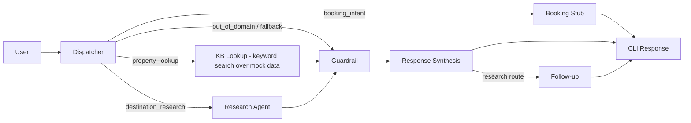

# AI Concierge MVP

A LangGraph-based multi-agent AI Concierge built on spec-first engineering principles, using a travel/hospitality domain (mock data) as the business case. The repo is the deliverable: a structured argument in running code demonstrating production-pattern AI orchestration.


```mermaid
flowchart LR
    U[User] --> D[Dispatcher]
    D -->|property_lookup| RAG[KB Lookup - keyword search over mock data]
    D -->|destination_research| RES[Research Agent]
    D -->|booking_intent| BK[Booking Stub]
    D -->|out_of_domain / fallback| G[Guardrail]
    RAG --> G
    RES --> G
    BK --> OUT[CLI Response]
    G --> SYN[Response Synthesis]
    SYN -->|research route| F[Follow-up]
    SYN --> OUT
    F --> OUT
```

---

## Table of Contents

- [Overview](#overview)
- [Tech Stack](#tech-stack)
- [Project Structure](#project-structure)
- [Quick Start](#quick-start)
- [Configuration](#configuration)
- [How It Works](#how-it-works)
  - [Hybrid Dispatcher Routing](#hybrid-dispatcher-routing)
  - [Agent Descriptions](#agent-descriptions)
  - [Memory Architecture](#memory-architecture)
  - [Observability & Tracing](#observability--tracing)
- [Testing](#testing)
- [Routing Eval](#routing-eval)
- [Navigating This Repo](#navigating-this-repo)

---

## Overview

This is a 5-day MVP demonstrating:

- **Keyword lookup over mock data, not RAG** — the `rag` route (a legacy name) does case-insensitive keyword matching over 6 hand-written destinations in `agents/kb/knowledge_base.json`. There are no embeddings, no vector store and no retrieval pipeline; `MockKnowledgeBase` marks where a real knowledge base would be swapped in
- **Spec-driven multi-agent engineering** — `spec/concierge-spec.md` committed before any runtime code
- **Hybrid dispatcher routing** — deterministic Stage 1 rules + LLM Stage 2 escalation with confidence scores
- **Per-agent model policy** — each agent declares its own Claude model via `prompts/{agent}/policy.yaml`
- **File-based dual-store memory** — user profiles (persistent) + session state (write-once), inspectable JSON, zero infrastructure
- **Production-pattern guardrails** — confidence thresholding, out-of-domain deflection, clarification loops, human handoff
- **Full observability** — structured `[trace]` output at every node boundary with field allowlist/denylist

---

## Tech Stack

| Layer | Technology |
|---|---|
| Language | Python 3.11+ |
| Graph orchestration | LangGraph 1.0.9 (StateGraph) |
| LLM provider | Anthropic Claude (Opus 4.6 / Sonnet 4.6 / Haiku 4.5) |
| Data validation | Pydantic 2.x |
| Web search | DuckDuckGo Search 8.x (no API key required) |
| Configuration | YAML policy files per agent |
| Memory | Local JSON files (profiles + sessions) |
| Testing | pytest 9.x + pytest-asyncio |
| Linting | Ruff + mypy (strict) |
| Dependency management | uv (pinned via `uv.lock`) |

**Model assignment per agent:**

| Agent | Normal mode | Fast mode (`--fast-mode`) |
|---|---|---|
| Dispatcher | claude-haiku-4-5 | claude-haiku-4-5 |
| Research Agent | claude-sonnet-4-6 | claude-haiku-4-5 |
| Response Synthesis | claude-sonnet-4-6 | claude-haiku-4-5 |
| KB Lookup agent (`rag` route) | claude-haiku-4-5 | claude-haiku-4-5 |
| Guardrail | claude-haiku-4-5 | claude-haiku-4-5 |
| Follow-up | claude-haiku-4-5 | claude-haiku-4-5 |

---

## Project Structure

```
LangGraph-AI-Concierge/
├── main.py                         # CLI entry point (--user, --fast-mode)
├── validate_config.py              # 11-check pre-flight validation
├── langgraph.json                  # LangGraph graph export
├── pyproject.toml                  # Python project config (Python 3.11+)
├── requirements.txt                # Pinned dependencies (uv-managed)
├── .env.example                    # Required env var template
│
├── spec/
│   └── concierge-spec.md           # Authoritative contract: state, types, edge topology
│
├── config/
│   └── routing_rules.yaml          # Stage 1 routing patterns + escalation_threshold: 0.72
│
├── prompts/
│   ├── dispatcher/                 # policy.yaml + v1.yaml + v2.yaml
│   ├── rag_agent/                  # policy.yaml + v1.yaml
│   ├── research_agent/             # policy.yaml + v1.yaml
│   ├── response_synthesis/         # policy.yaml + v1.yaml
│   ├── guardrail/                  # policy.yaml + v1.yaml
│   └── followup/                   # policy.yaml + v1.yaml
│
├── src/concierge/
│   ├── state.py                    # ConciergeState TypedDict + NodeName constants
│   ├── trace.py                    # Centralized trace() with field allowlist/denylist
│   ├── graph/__init__.py           # StateGraph topology, conditional edges, compilation
│   ├── agents/
│   │   ├── dispatcher.py           # Hybrid Stage 1 + Stage 2 routing
│   │   ├── rag_agent.py            # Keyword lookup over the mock KB (+ optional LLM ranking)
│   │   ├── research_agent.py       # DuckDuckGo web search (+ optional LLM ranking)
│   │   ├── response_synthesis.py   # Blended output with inline source attribution
│   │   ├── guardrail.py            # Confidence gate, out-of-domain, clarification, handoff
│   │   ├── followup.py             # Proactive suggestions (research route only)
│   │   ├── booking_agent.py        # Integration stub (BedrockBookingAPI swap point)
│   │   ├── mock_knowledge_base.py  # JSON KB with production swap-point comments
│   │   └── token_budget_manager.py # Context compression stub (activates at 6000 tokens)
│   └── nodes/                      # Thin node delegates wiring agents into the graph
│
├── agents/
│   └── kb/knowledge_base.json      # 6 travel destinations (Bali, Phuket, Koh Samui, Tokyo, Bangkok, Maldives)
│
├── memory/
│   ├── README.md                   # Memory architecture documentation
│   ├── profiles/alex.json          # Demo user profile (past trips, preferences, cached research)
│   └── sessions/                   # Write-once session state (git-excluded)
│
├── tests/
│   ├── unit/                       # 198 tests
│   ├── e2e/                        # 296 tests (graph runs with LLM and web search stubbed)
│   └── integration/                # conftest only, no tests
│
└── demo_script.md                  # 5 pre-validated queries with expected routing paths
```

---

## Quick Start

### Prerequisites

- Python 3.11+
- An [Anthropic API key](https://console.anthropic.com/)

### Install

```bash
# Clone and enter the repo
git clone <repo-url>
cd LangGraph-AI-Concierge

# Create virtual environment and install dependencies (using uv)
pip install uv
uv sync

# Copy and fill environment variables
cp .env.example .env
# Set ANTHROPIC_API_KEY=sk-ant-...
```

### Validate configuration

```bash
python validate_config.py
```

Runs 11 ordered pre-flight checks: Python version, API key presence, policy YAML schemas, model allowlist, prompt version files, dispatcher token limit (exact 128), guardrail threshold ordering, routing config, LangGraph version, memory profile integrity, and optional API probe.

### Run the concierge

```bash
# Standard mode (Opus/Sonnet/Haiku per policy)
python main.py --user alex

# Fast mode — all agents use Haiku (for development / cost savings)
python main.py --user alex --fast-mode
```

### Reset demo profile

```bash
git checkout -- memory/profiles/alex.json
```

### Run demo script

See [`demo_script.md`](demo_script.md) for 5 pre-validated queries with expected routing paths and confidence scores.

---

## Configuration

### Environment variables (`.env`)

| Variable | Required | Description |
|---|---|---|
| `ANTHROPIC_API_KEY` | Yes | Anthropic API key |
| `LANGCHAIN_TRACING_V2` | No | Enable LangSmith tracing |
| `LANGCHAIN_API_KEY` | No | LangSmith API key |
| `LANGCHAIN_PROJECT` | No | LangSmith project name |
| `SKIP_API_PROBE` | No | Set to `1` to skip API connectivity check |

### Agent policy (`prompts/{agent}/policy.yaml`)

Each agent declares its own policy contract:

```yaml
agent_name: research_agent
configured_model: claude-sonnet-4-6
prompt_version: v1
max_tokens: 1024
confidence_threshold: 0.70
allowed_tools:
  - duckduckgo_search
```

`--fast-mode` overrides `configured_model` to `claude-haiku-4-5` at runtime via the `AgentPolicy.model` property — no code changes required.

### Routing rules (`config/routing_rules.yaml`)

```yaml
escalation_threshold: 0.72   # Stage 1 confidence required to skip LLM call

rules:
  - pattern: <regex>
    intent: property_lookup
    route: rag
    score: 0.91
  - pattern: <regex>
    intent: booking_intent
    route: booking_stub
    score: 0.95
  ...
```

---

## How It Works

### Hybrid Dispatcher Routing

Every user turn passes through the Dispatcher, which runs a two-stage routing pipeline:

**Stage 1 — Rule-based pre-filter:**
Loads `config/routing_rules.yaml` and applies keyword/regex patterns to the user input. If a match exceeds `escalation_threshold: 0.72`, the intent is resolved deterministically — no LLM call.

**Stage 2 — LLM escalation:**
When Stage 1 confidence falls below threshold, the Dispatcher calls Claude Opus 4.6 with the full conversation history and a structured JSON response prompt. The returned `{intent, confidence}` drives routing to the appropriate specialist or fallback.

Every turn emits exactly one routing decision trace: `[dispatcher] intent=... confidence=... route=...`

### Agent Descriptions

| Agent | Route | Description |
|---|---|---|
| **KB Lookup agent** | `rag` | Keyword-searches `agents/kb/knowledge_base.json` for the current user input. Optional LLM ranking pass (set `RAG_AGENT_LLM_RANKING=1`). Returns structured destination entries tagged `[RAG]` (a legacy label; the lookup is not RAG). |
| **Research Agent** | `research` | Queries DuckDuckGo (up to 5 results) scoped to current input + last 3 turns. Degrades gracefully when search unavailable — labels response `[WEB SEARCH UNAVAILABLE — serving from internal KB only]`. |
| **Booking Stub** | `booking_stub` | Integration contract placeholder. Returns unavailability status with required env vars (`BOOKING_API_KEY`, `BOOKING_REGION`) and swap point for `BedrockBookingAPI`. |
| **Guardrail** | all paths | Confidence threshold gate (default 0.75). Issues clarifying questions on ambiguous intents, deflects out-of-domain queries, escalates to human handoff after max clarification attempts. |
| **Response Synthesis** | all paths | Blends KB-lookup and Research results into a cohesive response with inline `[RAG]` / `[Web]` source attribution. Filters `system_summary` messages from conversation history. |
| **Follow-up** | `research` only | Conditional node — fires only on the research route. Generates proactive next-step suggestions appended to the synthesized response. |

### Memory Architecture

Dual-store design — no external database required:

```
Session start:
  memory/profiles/{user_id}.json  ──► load profile + inject latest cached_research_session
                                       from most recent session file

Session end:
  ConciergeState  ──►  memory/sessions/{session_id}/state.json
                        (conversation_history, timestamps, turn_count, cached_research_session)
```

**Profile** (`memory/profiles/alex.json`):
- Long-lived, version-controlled
- Contains: `past_trips`, `preferences` (travel_style, room_type, activities, budget_tier), `cached_research_session`, `last_seen`
- Drives the proactive memory greeting before the user's first input

**Session** (`memory/sessions/{session_id}/state.json`):
- Write-once at session termination
- Git-excluded (sessions/.gitkeep preserves directory)
- Enables cross-session research context hydration on next login

### Observability & Tracing

All 7 nodes emit structured `[trace]` lines to stdout:

```
[dispatcher] intent=property_lookup confidence=0.91 route=rag
[rag] status=retrieved results=3
[guardrail] passed=true
[synthesis] source_attribution=RAG
[memory] event=profile_loaded past_trips_count=2
[memory] event=session_written session_id=session-abc123 turn_count=4
```

The centralized `trace()` function enforces an explicit **allowlist** (intent, confidence, route, model, session_id, status, results, etc.) and **denylist** (current_input, memory_profile, conversation_history, API keys) — sensitive data never leaks into CLI output.

**Token budget management:** `TokenBudgetManager` monitors context size and activates when conversation history approaches 6000 tokens (80% of model context). Oldest turns are compressed into `system_summary` messages; Response Synthesis filters these from user-facing output.

---

## Testing

```bash
uv sync --extra dev
uv run ruff check .      # lint (E, F, I, UP)
uv run mypy              # strict, on src/, main.py, evals/, validate_config.py
uv run pytest            # 497 tests, offline, ~3 s
```

CI (`.github/workflows/ci.yml`) runs the same three commands on Python 3.11 and 3.12. It has not run on GitHub yet: the branch is not pushed. Both versions were run locally with the same three commands.

### Test coverage

497 tests collected, 0 skipped: 198 in `tests/unit/`, 296 in `tests/e2e/` (many are parametrised, so this is far more than the 9 files), 3 in `tests/`.

Every test runs offline. An autouse fixture in `tests/conftest.py` makes web search raise and removes `ANTHROPIC_API_KEY`; `tests/unit/test_suite_is_offline.py` checks both. No test calls the Claude API: LLM calls are faked where a test needs one. So the suite shows the graph, routing rules, state handling and degradation paths work; it does not measure answer quality.

Tests that only checked a comment's wording were deleted rather than kept to inflate the count (4 so far, plus 6 earlier for a removed docs layout).

### Key test patterns

- **Contract tests** — validate YAML/JSON schemas match spec contracts
- **State mutation tests** — verify `reset_turn_state()` prevents stale data bleed across turns
- **Extensibility tests** — prove new agents can be added with zero Dispatcher code changes (FR36)
- **Prompt versioning tests** — validate `v1` → `v2` switch loads correct prompt file (FR37)

---

## Routing Eval

`evals/routing_labels.yaml` holds 40 labelled utterances (11 `rag`, 10 `research`, 9 `booking_stub`, 10 `fallback`). `evals/routing_eval.py` drives the real `DispatcherAgent.run()` and scores the route it picks. Results are in `evals/results/routing_eval.json`; the rules-only arm is re-checked against it by a test.

```bash
uv run python -m evals.routing_eval --write         # rules-only
uv run python -m evals.routing_eval --llm --write   # also rules+LLM with claude-opus-4-6 (reads ANTHROPIC_API_KEY from the gitignored .env)
uv run python -m evals.routing_eval --only-model claude-haiku-4-5 --write   # run one arm and merge it into the results file
```

| Route | Rules only | Rules + Opus 4.6 | Rules + Haiku 4.5 |
|---|---|---|---|
| `rag` | 18% (2/11) | 55% (6/11) | 64% (7/11) |
| `research` | 30% (3/10) | 30% (3/10) | 30% (3/10) |
| `booking_stub` | 67% (6/9) | 67% (6/9) | 67% (6/9) |
| `fallback` | 100% (10/10) | 100% (10/10) | 100% (10/10) |
| **Overall** | **52% (21/40)** | **62% (25/40)** | **65% (26/40)** |

- LLM stage, one run per model on the same 40 rows (the rules decide 12; the LLM sees the other 28):
  - `claude-opus-4-6` (ID still valid; selectable by setting `model` in `prompts/dispatcher/policy.yaml`): 28 calls, 4,411 input / 621 output tokens, about $0.038 at list price.
  - `claude-haiku-4-5` (now the router default in `prompts/dispatcher/policy.yaml`): 28 calls, 4,383 input / 1,425 output tokens, about $0.012.
  - Haiku scores one row higher (a `rag` row) at about a third of the cost. One row on one run is noise, so read it as "no measurable gain from the bigger model on this set", not "Haiku is better".
- **Router default:** the dispatcher now uses `claude-haiku-4-5`. On this set it matched Opus 4.6 (65% vs 62%, one row) at about a third of the cost; that is one run on 40 rows, so the reason for the switch is "no measurable gain from the bigger model", not "Haiku is better". To go back, set `model: claude-opus-4-6` in `prompts/dispatcher/policy.yaml`; nothing else changes (`tests/unit/test_dispatcher_model_default.py`).
- `fallback` is 100% in every arm because a turn nobody decides falls through to it, which says nothing about the LLM.
- With either LLM on, 7 of 10 `research` and 5 of 11 `rag` utterances still end in `fallback` (see `confusion` in the JSON). Why was not investigated, and the rules and the 0.75 confidence threshold have not been tuned against this set.
- Limits: 40 rows labelled in one pass, one run per model, no repeat to measure LLM variance, and no check for overlap between the utterances and the dispatcher's prompt examples. Treat the gap between rules-only and rules+LLM as indicative, not a benchmark.

---

## Navigating This Repo

1. **Read the contract first:** [`spec/concierge-spec.md`](spec/concierge-spec.md) — defines `ConciergeState` TypedDict, `AgentPolicy` Pydantic model, and all agent handoff types.
2. **Validate the environment:** `python validate_config.py` — 11 pre-flight checks before any LLM call.
3. **Run the demo:** Follow [`demo_script.md`](demo_script.md) — 5 queries covering all routing paths.
4. **Inspect routing and prompt config:** `config/routing_rules.yaml` and `prompts/*/policy.yaml`.
5. **Planning history:** `_documentation/` holds the original planning artifacts.
6. **Explore memory:** `memory/README.md` and baseline profile `memory/profiles/alex.json`.
