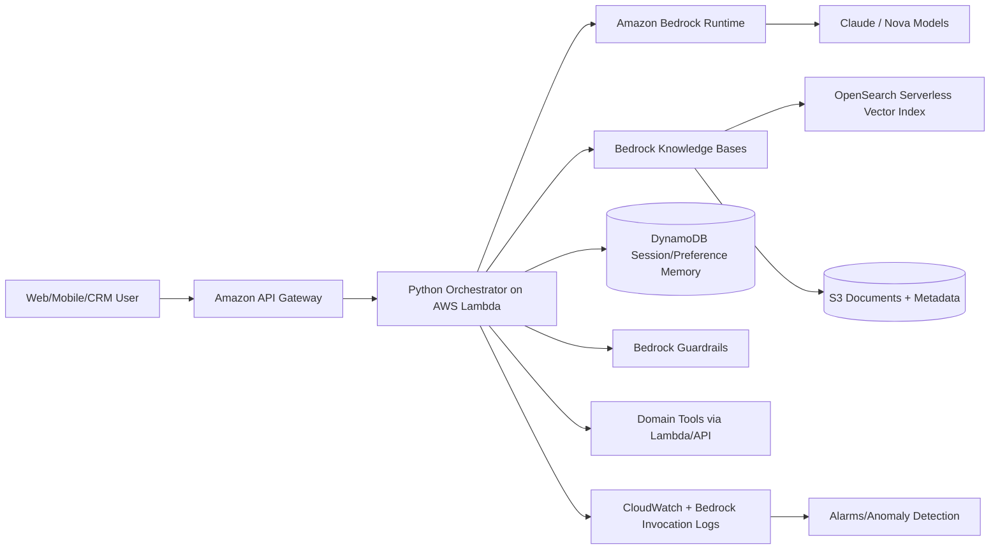
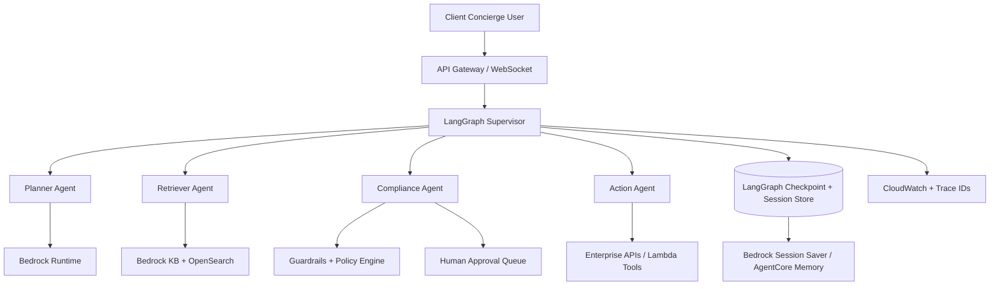
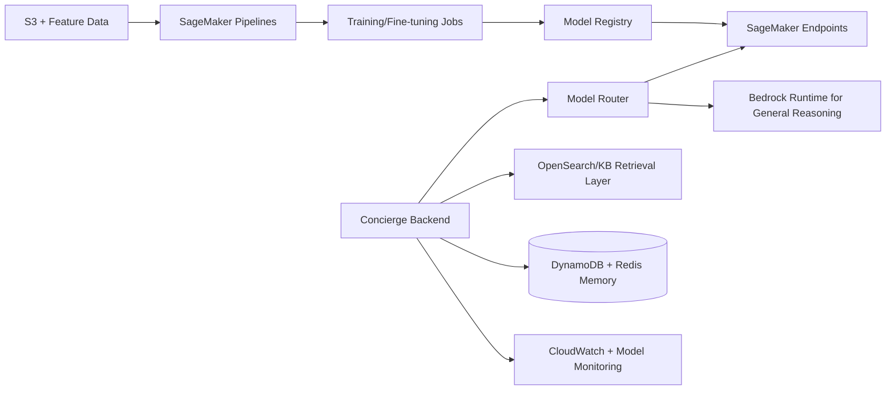
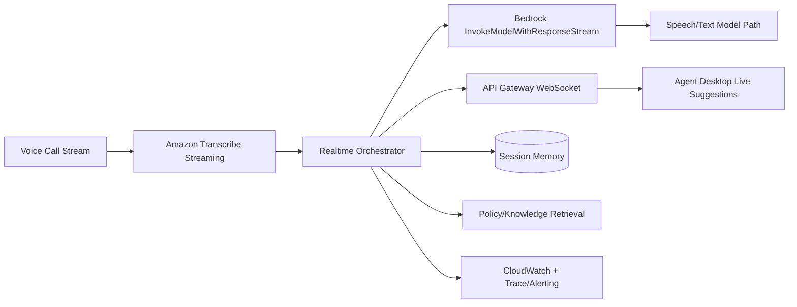

# Comprehensive AWS AI Architecture Research: Client Concierge and Exam-Aligned Business Cases

**Date:** 2026-02-23  
**Author:** Andrey + Mary (Technical Research Facilitation)  
**Research Type:** Technical architecture and implementation strategy

---

## Executive Summary

This research proposes four AWS-native architecture approaches for your Client Concierge initiative (personalized, multi-turn, cross-channel conversational AI) and maps them to recurring business-case patterns from your AWS exam material (RAG precision, streaming voice assistants, governance, observability, token control, and scalable multi-agent orchestration).

**Recommendation:** Start with a **Bedrock-first managed architecture** for faster delivery and lower operational overhead, then adopt **LangGraph-based orchestration** for complex multi-step workflows, and introduce **SageMaker AI** only where you need custom/fine-tuned models or deep ML control.

**Key decision outcome:**
- Bedrock is best for managed model access, rapid experimentation, and governance at scale.
- SageMaker AI is best for custom model lifecycle ownership and advanced MLOps.
- LangChain/LangGraph should be used selectively where orchestration complexity justifies it; keep simple tasks LLM-only.

---

## Table of Contents

1. Research Overview and Methodology  
2. Project Context and Business Drivers  
3. Latest AWS-Available LLM Model Landscape (2026-02)  
4. Bedrock vs SageMaker AI Decision Framework  
5. Architecture Approach A: Bedrock-First Managed Concierge  
6. Architecture Approach B: LangGraph-Orchestrated Multi-Agent Platform  
7. Architecture Approach C: SageMaker-Customized Intelligence Platform  
8. Architecture Approach D: Real-Time Voice Concierge/Copilot  
9. Business Cases Mapped from Exam Scenarios  
10. RAG and Memory Organization Strategy  
11. LangChain/LangGraph vs LLM-Only: When to Use What  
12. Security, Governance, and Operational Controls  
13. Implementation Roadmap and KPIs  
14. Sources and Verification Notes

---

## Research Overview

This document combines three inputs: (1) your position/project description, (2) AWS exam business-case scenarios extracted from `AWS Professional.docx`, and (3) the 40-principles systems-design file. It translates them into architecture options, implementation decisions, and service-level recommendations.

Methodology used:
- Local source analysis of project and case files.
- Current-source validation against official AWS documentation and primary framework docs.
- Architecture synthesis with explicit tradeoff analysis.
- Practical guidance for implementation on AWS with diagrams.

For full strategic recommendations and rationale, see the sections below, especially sections 4 through 11.

---

## 1. Research Overview and Methodology

### Scope covered

- Conversational AI with multi-turn, cross-channel continuity.
- Chat + voice workflows.
- RAG at enterprise scale with citation/grounding requirements.
- Memory strategy (session, episodic, long-term preference).
- Model selection and governance.
- Agentic orchestration and operational reliability.

### Sources and validation model

- Official AWS docs for Bedrock, SageMaker AI, model support, guardrails, KB search/chunking, flows, sessions, inference profiles, and monitoring.
- Official LangChain and LangGraph docs for orchestration patterns.
- Inference notes are clearly marked where direct documentation does not prescribe a single architecture.

---

## 2. Project Context and Business Drivers

From `Description.txt`, the target system is a **Client Concierge** capability with:
- High personalization
- Multi-turn and context-aware continuity
- Cross-channel behavior (chat, voice, web)
- Proactive outcome completion
- Strong Python/backend integration and spec-driven delivery

From `AWS Professional.docx`, recurring high-value patterns include:
- Hybrid RAG retrieval and metadata filtering
- Real-time streaming assist (call center patterns)
- Prompt and model governance across accounts
- Hallucination/cost observability
- Large-scale ingestion and preprocessing
- Multi-agent coordination with memory and access control

Inference: this project should be designed as an extensible AI platform with reusable control-plane components, not as a single chatbot deployment.

---

## 3. Latest AWS-Available LLM Model Landscape (2026-02)

### What is currently available on AWS

Amazon Bedrock provides managed access to AWS and third-party models and now advertises broad provider coverage (including Anthropic, Meta, DeepSeek, OpenAI, and Amazon Nova families) [S1]. Bedrock model support tables currently include recent Claude 4.x and 4.5 variants [S2].

Amazon Nova includes:
- **Text/multimodal understanding models**: Micro, Lite, Pro, Premier [S3]
- **Speech-to-speech model**: Nova Sonic [S3]
- **Creative models**: Canvas (image), Reel (video) [S3]
- **Nova 2 generation** updates announced for Lite/Pro preview [S4]

### Model recommendation by workload type

| Workload | Recommended model tier on AWS | Why |
|---|---|---|
| General chat concierge | Claude Sonnet 4 / 4.5 or Nova Pro | Strong reasoning + dialog quality + managed Bedrock controls |
| Fast/low-cost routing + classification | Claude Haiku 4.5 or Nova Micro/Lite | Lower latency/cost for high-throughput utility tasks |
| Complex planning and tool-heavy workflows | Claude Opus 4.x / Sonnet 4.5 | Better long-horizon reasoning and tool planning |
| Voice real-time assistant | Nova Sonic (speech-to-speech) OR Transcribe + Bedrock text model | Managed voice modality path on AWS [S3][S11] |
| Multimodal (image/video context) | Nova Pro/Premier + Canvas/Reel (if generation needed) | Unified AWS native model family [S3] |

**Important:** exact model availability is region- and account-access dependent. Confirm in Bedrock model access and supported-model tables before final hard-coding [S2].

---

## 4. Bedrock vs SageMaker AI Decision Framework

### Core difference

- **Amazon Bedrock**: managed foundation model access + GenAI platform capabilities (knowledge bases, guardrails, flows, model eval, agent capabilities) with minimal infra management [S1].
- **Amazon SageMaker AI**: build/train/fine-tune/deploy ML models with deeper MLOps and model lifecycle control [S5].

### Decision table

| Dimension | Bedrock | SageMaker AI |
|---|---|---|
| Time-to-market | Best (managed APIs) | Slower (more setup/control plane) |
| Ops overhead | Lower | Higher |
| Model customization depth | Moderate (incl. customization options) [S6] | Highest |
| Governance out-of-box | Strong Bedrock-native controls | Requires composed MLOps/security design |
| Best for | Product teams shipping GenAI quickly | ML platform teams owning full model lifecycle |

### Practical recommendation for this project

1. **Phase 1-2:** Bedrock-first for concierge MVP and production hardening.  
2. **Phase 3+:** introduce SageMaker for targeted model specialization if business metrics justify custom training/fine-tuning.  
3. Keep unified API abstractions so model backend can evolve without rewriting orchestration.

---

## 5. Architecture Approach A: Bedrock-First Managed Concierge

### Best fit

- Fastest path to enterprise-ready concierge capabilities
- Strong managed governance and observability
- Minimal infrastructure burden

### Mermaid architecture

### Why it aligns to your cases

- Hybrid RAG + metadata filtering patterns map cleanly to Bedrock KB + OpenSearch [S7][S8].
- Guardrails + logs + anomaly detection align with safety/cost control cases [S9][S10].
- Streaming response path supports conversational UX and partial output patterns [S11].

---

## 6. Architecture Approach B: LangGraph-Orchestrated Multi-Agent Platform

### Best fit

- Multi-step, stateful workflows with planner/retriever/compliance/executor roles
- Human approvals and deterministic checkpoints
- Scenarios with many tool calls and branch logic

### Mermaid architecture

### AWS + framework evidence

AWS AgentCore docs include LangChain/LangGraph integration references and session saver utilities [S12][S13]. LangGraph itself is designed for stateful, controllable agent workflows [S14].

Inference: this approach is the right midpoint between pure Bedrock managed and full custom orchestration when you need explicit state-graph control.

---

## 7. Architecture Approach C: SageMaker-Customized Intelligence Platform

### Best fit

- Strong need for custom model behavior, private model artifacts, deep MLOps
- Domain-specialized recommendation/ranking models beyond prompt-only optimization
- Strict offline/online evaluation lifecycle owned by ML platform team

### Mermaid architecture

### Key tradeoff

Higher control and potentially better domain optimization, but materially higher platform complexity versus Bedrock-first.

---

## 8. Architecture Approach D: Real-Time Voice Concierge/Copilot

### Best fit

- Call-center augmentation
- Live conversational assistance with low-latency partial response updates

### Mermaid architecture

This follows AWS managed streaming primitives and aligns to real-time copilot exam patterns [S11]. For fully speech-native interaction, evaluate Nova Sonic in Bedrock [S3].

---

## 9. Business Cases Mapped from Exam Scenarios

| Business Case Pattern | Recommended Architecture | Key AWS Services |
|---|---|---|
| Legal/regulated RAG with semantic + keyword precision | A or B | Bedrock KB, OpenSearch hybrid retrieval, metadata filters |
| Real-time call center copilot | D (or B+D hybrid) | Transcribe Streaming, Bedrock streaming API, WebSocket |
| Multilingual compliance support with metadata filters | A | Bedrock KB + OpenSearch metadata + citations |
| Personalized product recommendations with hallucination control | B or C | Bedrock + catalog validation tools; optionally SageMaker rankers |
| Enterprise multi-account governance and model restrictions | A or B | IAM, SCP, Guardrails, model access governance |
| Massive ingestion/preprocessing pipeline | A or C | Bedrock Data Automation + S3 + DynamoDB; or SageMaker pipelines |

---

## 10. RAG and Memory Organization Strategy

### RAG organization

1. **Ingestion**: S3 canonical document store + metadata attributes (business unit, sensitivity, date, locale).  
2. **Indexing**: Bedrock Knowledge Bases with OpenSearch vector backend for production scale and optional hybrid behavior [S7][S8].  
3. **Chunking**: start with hierarchical/semantic chunking for long structured docs; validate citation accuracy by domain.  
4. **Retrieval policy**: top-k by semantic match + metadata filters + optional reranking before generation.  
5. **Grounding controls**: require citation output format and fail-safe responses when confidence is low.

### Memory organization

- **Short-term/session memory**: active turn context, tool outputs, current task state (DynamoDB/Bedrock sessions).  
- **Episodic memory**: completed journeys and resolution patterns (append-only event log + summarized embeddings).  
- **Long-term preference memory**: user profile, channel preferences, consented personalization attributes.  
- **Guardrails on memory writes**: confidence threshold, PII policy, TTL/retention, and explicit schema.

Inference: memory should be treated as governed data product, not free-form transcript accumulation.

---

## 11. LangChain/LangGraph vs LLM-Only: When to Use What

### LLM-only (preferred when simple)

Use direct LLM invocation when task is:
- Single-turn or shallow multi-turn
- Low tool-call complexity
- Latency-sensitive with minimal branching
- Easy to validate deterministically

Examples in this project:
- Short response rewrite
- Sentiment labeling/routing hints
- Simple FAQ generation with fixed template

### LangChain (mid complexity)

Use LangChain when you need:
- Structured prompt/tool/retriever composition
- Provider abstraction and reusable chains
- Faster assembly of repeatable pipelines

Examples:
- RAG pipeline with retrieval + output parser
- Multi-prompt workflows with standard observability wrappers

### LangGraph (high complexity, stateful)

Use LangGraph when you need:
- Explicit state machine/graph orchestration
- Multi-agent coordination
- Human-in-the-loop nodes
- Pause/resume/retry with checkpointing

Examples:
- Concierge workflow: intent -> plan -> retrieve -> compliance -> action -> follow-up
- Complex enterprise tasks with approval gates and compensating actions

### Decision matrix

| Criterion | LLM-only | LangChain | LangGraph |
|---|---|---|---|
| Complexity | Low | Medium | High |
| Stateful control | Minimal | Moderate | Strong |
| Multi-agent support | No | Limited | Native pattern |
| Operational overhead | Lowest | Medium | Highest |
| Best for | Fast/simple tasks | Composed pipelines | Durable agent workflows |

---

## 12. Security, Governance, and Operational Controls

Use layered controls:
- IAM least privilege for runtime/tool roles.
- SCP guardrails for approved model and region usage in multi-account orgs.
- Bedrock Guardrails for harmful/off-topic/prohibited content policy [S9].
- Bedrock model invocation logging + CloudWatch anomaly alarms for token/cost drift [S10].
- Inference profiles for cross-region/throughput patterns where policy allows [S15].
- Full traceability for decisions, tool calls, and human approvals.

---

## 13. Implementation Roadmap and KPIs

### Suggested phased rollout

1. **Foundation**: Bedrock-first architecture A with core RAG and memory.  
2. **Workflow depth**: introduce LangGraph orchestration for high-complexity flows.  
3. **Voice**: add architecture D for real-time channels and contact-center copilots.  
4. **Optimization**: evaluate SageMaker path C only for targeted high-value custom model needs.  

### KPI set

- Quality: grounded-answer rate, citation correctness, hallucination rate
- Operations: p95 latency, streaming first-token time, cost per successful outcome
- Safety: guardrail hit rate, policy violation attempts blocked, HITL escalation volume
- Business: task completion rate, containment rate, customer satisfaction, agent-assist productivity lift

---

## 14. Sources and Verification Notes

### Source list

- [S1] Amazon Bedrock overview: https://docs.aws.amazon.com/bedrock/latest/userguide/what-is-bedrock.html
- [S2] Bedrock supported models (Converse API table): https://docs.aws.amazon.com/bedrock/latest/userguide/conversation-inference-supported-models-features.html
- [S3] Amazon Nova model families and capabilities: https://docs.aws.amazon.com/nova/latest/userguide/what-is-nova.html
- [S4] Nova 2 announcement (Lite/Pro preview): https://aws.amazon.com/about-aws/whats-new/2025/12/amazon-nova-2-foundation-models-ultracost-effective-intelligence/
- [S5] What is SageMaker AI: https://docs.aws.amazon.com/sagemaker/latest/dg/whatis.html
- [S6] Bedrock model customization options: https://docs.aws.amazon.com/bedrock/latest/userguide/custom-models.html
- [S7] Bedrock Knowledge Bases vector search config (HYBRID/SEMANTIC): https://docs.aws.amazon.com/bedrock/latest/APIReference/API_KnowledgeBaseVectorSearchConfiguration.html
- [S8] Bedrock Knowledge Bases retrieval and citations: https://docs.aws.amazon.com/bedrock/latest/userguide/knowledge-base.html
- [S9] Bedrock Guardrails: https://docs.aws.amazon.com/bedrock/latest/userguide/guardrails.html
- [S10] Model invocation logging for Bedrock: https://docs.aws.amazon.com/bedrock/latest/userguide/model-invocation-logging.html
- [S11] Bedrock streaming inference API: https://docs.aws.amazon.com/bedrock/latest/APIReference/API_runtime_InvokeModelWithResponseStream.html
- [S12] AgentCore + LangChain/LangGraph integrations: https://docs.aws.amazon.com/bedrock-agentcore/latest/devguide/identity-userguide-integrations.html
- [S13] Bedrock Session Saver for LangGraph: https://docs.aws.amazon.com/bedrock-agentcore/latest/devguide/memory-integrations-langgraph.html
- [S14] LangGraph docs: https://docs.langchain.com/oss/python/langgraph/overview
- [S15] Bedrock inference profiles (cross-region): https://docs.aws.amazon.com/bedrock/latest/userguide/inference-profiles.html

### Inference notes

- Model-to-use-case mapping is an architecture recommendation inferred from model capability docs and platform constraints; run focused A/B evaluation for your target workloads before final model lock.
- Bedrock-first recommendation is based on your stated need for rapid delivery, strong governance, and conversational feature breadth.

---

## Technical Research Conclusion

For your specific project profile, the strongest path is:
1. **Bedrock-first managed concierge platform** for initial delivery and governance.
2. **LangGraph orchestration** where workflows become multi-step, stateful, and approval-gated.
3. **SageMaker AI augmentation** only for high-value custom-model scenarios.
4. **Voice extension** using managed streaming primitives and Nova Sonic/text paths.

This architecture set is consistent with the technical themes in your exam business cases and with your role focus on AI-native, spec-driven delivery of enterprise conversational outcomes.

**Technical Research Completion Date:** 2026-02-23  
**Source Verification:** Completed with current official documentation  
**Confidence Level:** High for platform patterns; medium-high for model choice pending environment-specific benchmarking
